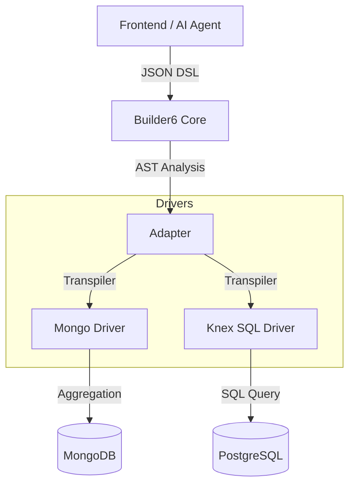

# Builder6 ObjectQL

<div align="center">

 **One Protocol, Any Database, AI-Ready.**

A modern, dual-stack data query engine designed for the AI era.  
Write your logic once in JSON-DSL, run it seamlessly on MongoDB (for flexible design) or PostgreSQL (for strict production).

[](LICENSE)
[](http://www.typescriptlang.org/)
[]()

</div>

---

## 📖 Introduction

**Builder6 ObjectQL** is a complete rewrite of the legacy `@steedos/objectql` engine. It addresses the modern challenge of building dynamic, low-code applications: **The conflict between flexible design and structured storage.**

In a typical lifecycle:
1.  **Design Time:** You want the flexibility of MongoDB to drag-and-drop fields without schema migrations.
2.  **Run Time:** Enterprises demand the reliability, ACID transactions, and BI compatibility of SQL (PostgreSQL).

Builder6 ObjectQL bridges this gap with a unified **JSON-DSL** that compiles to native queries for both worlds.

## ✨ Key Features

-   **🚀 Dual-Stack Engine:**
    -   **Mongo Driver:** Native performance for schema-less data and rapid prototyping.
    -   **Knex SQL Driver:** First-class support for PostgreSQL, MySQL, and SQLite. Utilizes `JSONB` for dynamic columns while keeping core fields structured.
-   **🤖 AI-First Design:**
    -   Queries are defined as standardized JSON objects (AST), not strings.
    -   Optimized for LLMs (ChatGPT/Claude) to understand and generate accurate business logic.
-   **⚡ Modern Stack:**
    -   Written in 100% TypeScript.
    -   **Zero heavy dependencies.** No more `Meteor`, `Fibers`, or legacy wrappers.
    -   Promise-based asynchronous API.
-   **🔌 Pluggable Architecture:**
    -   Core logic is decoupled from storage drivers.
    -   Easy to implement custom adapters (e.g., REST, GraphQL wrapper).


## 📦 Installation

```bash
# Install core
npm install @builder6/objectql

# Install drivers as needed
npm install @builder6/objectql-driver-mongo
npm install @builder6/objectql-driver-knex

```

## ⚡ Quick Start

### 1. Define your App & Drivers

```typescript
import { B6App } from '@builder6/objectql';
import { MongoDriver } from '@builder6/objectql-driver-mongo';
import { KnexDriver } from '@builder6/objectql-driver-knex';

const app = new B6App({
  datasources: {
    // Cloud Design Environment
    design: new MongoDriver({ url: process.env.MONGO_URL }),
    // Local Production Environment
    runtime: new KnexDriver({ client: 'pg', connection: process.env.PG_URL })
  }
});

```

### 2. The Unified Query (JSON-DSL)

This syntax is designed to be easily generated by AI agents and frontend UI builders.

```typescript
// Find orders with amount > 1000 and expand customer details
const query = {
  entity: 'orders',
  fields: ['id', 'order_no', 'amount', 'created_at'],
  filters: [
    ['status', '=', 'paid'],
    'and',
    ['amount', '>', 1000]
  ],
  sort: [['created_at', 'desc']],
  expand: {
    customer: {
      fields: ['name', 'email']
    }
  }
};

// Execute on MongoDB
const resultsMongo = await app.datasource('design').find(query);

// Execute on PostgreSQL (Auto-transpiled to SQL with JOINs)
const resultsSql = await app.datasource('runtime').find(query);

```

## 🏗 Architecture



## 🛣 Roadmap

* [ ] **Phase 1: Core Protocol:** Define `UnifiedQuery` types and AST parser.
* [ ] **Phase 2: Mongo Driver:** Parity with basic Steedos functionality.
* [ ] **Phase 3: SQL Driver:** Implement "Core Columns + JSONB" strategy via Knex.js.
* [ ] **Phase 4: CLI Tools:** Schema sync and TypeScript type generation (`b6 generate`).

## 🤝 Contributing

We welcome contributions! This project is intended to be the foundation for the next generation of open-source low-code platforms.

## 📄 License

MIT © [Builder6 Inc.](https://builder6.com)
