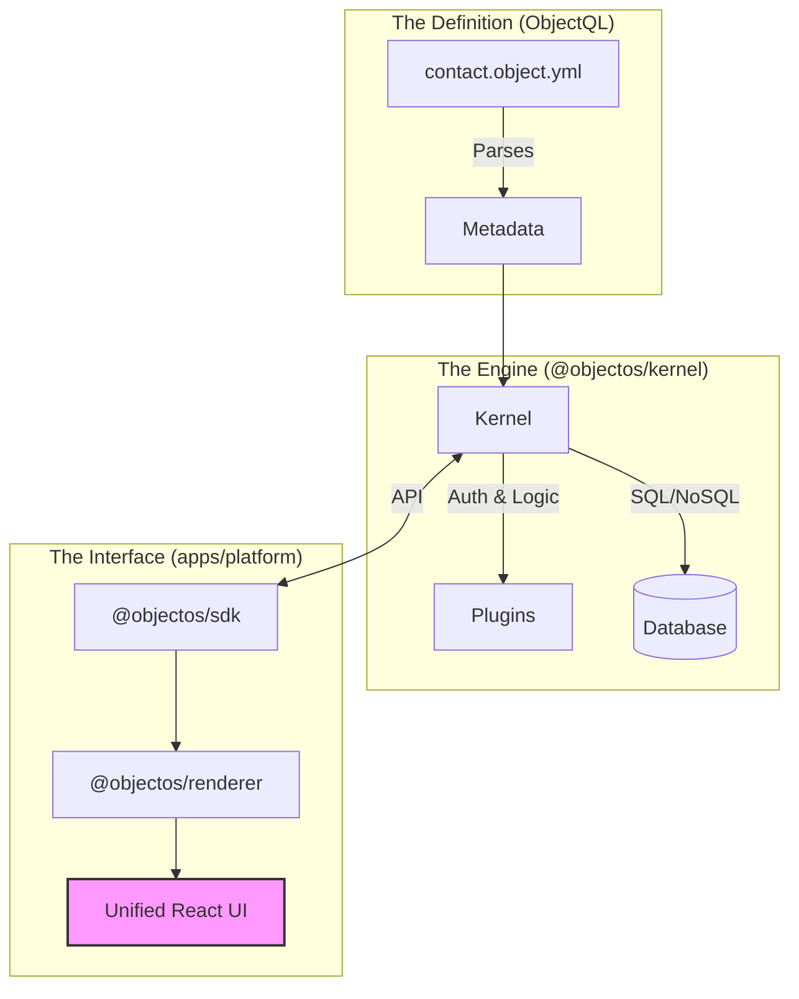

# ObjectOS

<div align="center">

**Open-source alternative to Salesforce & Airtable.**
*A full-stack low-code platform with metadata-driven backend and auto-generated React UI.*

[Documentation](https://objectos.org) · [中文文档](docs/zh/) · [Protocol Specs](https://github.com/objectql/objectql) · [AI Builder](https://www.builder6.ai)

**[English](README.md) | [简体中文](README.zh-CN.md)**

</div>

---

## 📖 Introduction

**ObjectOS** is the unified low-code platform for the AI era.

Most platforms force you to choose: flexibility (like **Airtable**) or structure (like **Salesforce**). ObjectOS gives you both in a single, open-source package.

By defining your business logic in standard `*.object.yml` files (powered by [ObjectQL](https://github.com/objectql/objectql)), ObjectOS instantly generates:

1. **A Powerful Backend:** Node.js kernel with built-in Auth, Permissions (RBAC/RLS), and Workflow.
2. **A Unified Frontend:** A React application that combines high-performance Data Grids with enterprise-grade Detail Forms.

## ✨ Key Features

### 🖥️ The Unified UI (Hybrid Experience)

Stop building separate "Admin Panels" and "Dashboards".

* **Grid View (Airtable-like):** Powered by **TanStack Table**. Supports resizing, sorting, and inline editing for mass data entry.
* **Detail Drawer (Salesforce-like):** Click any row to slide out a structured form with related lists and activity feeds.
* **Auto-Generated:** Zero frontend code required. Rendered dynamically from metadata.

### ⚙️ The Metadata Engine

* **Protocol Driven:** Describes data, validation, and layout in pure YAML.
* **Database Agnostic:** Runs on PostgreSQL, MongoDB, or SQLite.
* **Enterprise Security:** Field-level security and record-level sharing rules out of the box.

### 🤖 AI-First Architecture

ObjectOS is designed to be the "Execution Layer" for AI.

* Don't write boilerplate. Let AI generate your `object.yml` and complex formulas.
* The runtime handles the heavy lifting (CRUD, Validation, State Management).

---

## 🏗 Architecture

ObjectOS is a Monorepo that bridges the gap between Protocol and User Experience.



---

## 🚀 Quick Start

Build a CRM in less than a minute.

### 1. Create a Project

```bash
npx create-objectos-app my-company
cd my-company
npm install

```

### 2. Define an Object

Create `objects/deal.object.yml`:

```yaml
name: deals
label: Sales Deal
icon: dollar-sign
fields:
  title:
    type: text
    required: true
  amount:
    type: currency
    scale: 2
  stage:
    type: select
    options: ["New", "Negotiation", "Won", "Lost"]
  close_date:
    type: date

```

### 3. Run the Platform

```bash
npm run dev

```

Visit `http://localhost:3000`.
You will see a **Data Grid** for Deals. Click "New" to see the **Form**. All CRUD operations work instantly.

---

## 📦 Ecosystem

| Package | Description |
| --- | --- |
| **`apps/web`** | The unified frontend application (React + Shadcn UI). |
| **`@objectos/kernel`** | The backend logic engine. |
| **`@objectos/server`** | The NestJS API gateway. |

---

## 🤝 Contributing

We are building the future of open-source business software.

* **Core Protocol:** Contribute to [objectql/objectql](https://github.com/objectql/objectql).
* **Runtime & UI:** Submit PRs to this repository.

## 📚 中文文档 (Chinese Documentation)

完整的中文文档已提供，包括：

* **[项目简介](docs/zh/项目简介.md)** - 了解 ObjectOS 的核心价值、技术架构和应用场景
* **[商业战略](docs/zh/商业战略.md)** - 市场定位、商业模式和发展战略
* **[开发计划](docs/zh/开发计划.md)** - 技术路线图、功能规划和团队建设

[查看所有中文文档 →](docs/zh/)

## 📄 License

MIT © [ObjectOS Team](https://objectos.org)