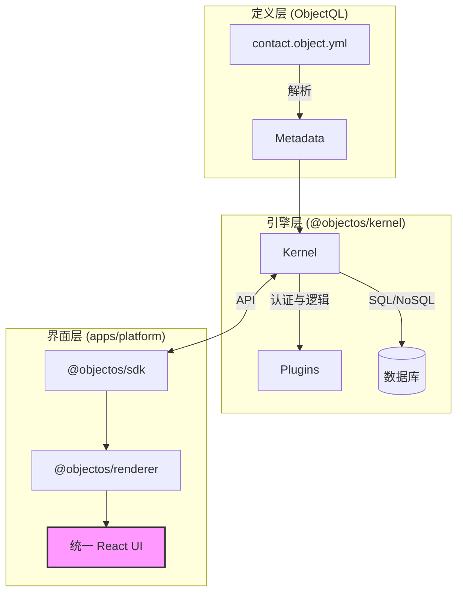

# ObjectOS 中文版

<div align="center">

**Salesforce 和 Airtable 的开源替代方案**  
*元数据驱动的全栈低代码平台，自动生成后端 API 和 React 前端界面*

[英文文档](./README.md) · [中文文档](./docs/zh/) · [协议规范](https://github.com/objectql/objectql) · [AI Builder](https://www.builder6.ai)

</div>

---

## 📖 简介

**ObjectOS** 是新一代 AI 时代的统一低代码平台。

大多数平台会强迫你做出选择：要么选择灵活性（如 **Airtable**），要么选择结构化（如 **Salesforce**）。ObjectOS 让你在一个开源平台上同时拥有两者。

通过在标准 `*.object.yml` 文件中定义业务逻辑（基于 [ObjectQL](https://github.com/objectql/objectql) 协议），ObjectOS 可以即时生成：

1. **强大的后端：** Node.js 内核，内置身份认证、权限控制（RBAC/RLS）和工作流。
2. **统一的前端：** React 应用，结合了高性能数据网格和企业级详情表单。

## ✨ 核心特性

### 🖥️ 混合式用户界面

不再需要分别构建"管理后台"和"仪表盘"。

* **网格视图（类似 Airtable）：** 基于 **TanStack Table**。支持调整列宽、排序和行内编辑，适合大批量数据录入。
* **详情抽屉（类似 Salesforce）：** 点击任意行，右侧滑出结构化表单，包含关联列表和活动动态。
* **自动生成：** 无需编写前端代码。完全由元数据动态渲染。

### ⚙️ 元数据引擎

* **协议驱动：** 使用纯 YAML 描述数据、验证和布局。
* **数据库无关：** 支持 PostgreSQL、MongoDB 或 SQLite。
* **企业级安全：** 开箱即用的字段级安全和记录级共享规则。

### 🤖 AI 优先架构

ObjectOS 被设计为 AI 的"执行层"。

* 不用编写样板代码。让 AI 生成 `object.yml` 和复杂公式。
* 运行时负责繁重的工作（CRUD、验证、状态管理）。

---

## 🏗 架构

ObjectOS 是一个 Monorepo，连接协议定义和用户体验。



---

## 🚀 快速开始

在不到一分钟内构建一个 CRM 系统。

### 1. 创建项目

```bash
npx create-objectos-app my-company
cd my-company
npm install
```

### 2. 定义一个对象

创建 `objects/deal.object.yml`：

```yaml
name: deals
label: 销售机会
icon: dollar-sign
fields:
  title:
    type: text
    required: true
  amount:
    type: currency
    scale: 2
  stage:
    type: select
    options: ["新建", "洽谈中", "赢单", "丢单"]
  close_date:
    type: date
```

### 3. 运行平台

```bash
npm run dev
```

访问 `http://localhost:3000`。  
你将看到一个**数据网格**来管理销售机会。点击"新建"查看**表单**。所有 CRUD 操作立即可用。

---

## 📚 完整中文文档

我们提供了全面的中文文档，包括：

### 📖 [项目简介](./docs/zh/项目简介.md)
- 项目定位与核心理念
- ObjectQL 与 ObjectOS 的关系  
- 详细的技术架构
- 核心特性介绍
- 与竞品对比（Salesforce、Airtable、Odoo 等）
- 适用场景分析
- 快速开始指南

### 💼 [商业战略](./docs/zh/商业战略.md)
- 战略定位与三大战略支柱
- 目标市场分析（规模 $270 亿 → $1,870 亿）
- 竞争格局与差异化优势
- 商业模式设计（开源 + 云服务）
- 收入来源与 5 年收入预测
- Go-to-Market 策略
- 风险管理与应对措施
- 战略合作规划

### 🛠 [开发计划](./docs/zh/开发计划.md)
- 开发原则与技术栈
- 架构演进路线（单体 → 微服务 → 边缘计算）
- 详细功能开发路线图（2026-2027）
- 团队结构与招聘计划
- 质量保障体系（测试策略、性能基准）
- DevOps 基础设施
- 版本发布计划
- 成功指标（KPI）

[查看完整中文文档目录 →](./docs/zh/)

---

## 📦 生态系统

| 包名 | 描述 |
| --- | --- |
| **`apps/web`** | 统一前端应用（React + Shadcn UI） |
| **`@objectos/kernel`** | 后端逻辑引擎 |
| **`@objectos/server`** | NestJS API 网关 |

---

## 🤝 参与贡献

我们正在构建开源商业软件的未来。

* **核心协议：** 为 [objectql/objectql](https://github.com/objectql/objectql) 做贡献
* **运行时与 UI：** 向本仓库提交 PR

详见：[贡献指南](./CONTRIBUTING.md)

---

## 📞 联系我们

- **文档网站：** [objectos.org](https://objectos.org)
- **GitHub 讨论：** [Discussions](https://github.com/objectql/objectos/discussions)
- **问题追踪：** [Issues](https://github.com/objectql/objectos/issues)

---

## 📄 开源协议

MIT © [ObjectOS Team](https://objectos.org)

---

**ObjectOS - 让企业应用开发回归本质：描述业务，而非编写代码。**
